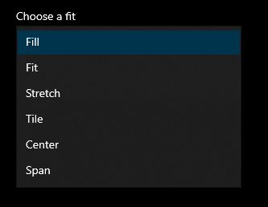

# DesktopWallpaper

A PowerShell module to change desktop background.

Contains two cmdlets:

1. `Test-Image`
2. `Set-Wallpaper`

`Test-Image` cmdlet supports these file types:
- BMP
- GIF
- TIFF
- PNG
- JPEG

`Set-Wallpaper` cmdlet changes the desktop background to the given image. It also has an optional parameter `-Fit` to change the fit style of the background as shown in the background personalization menu of Windows 10.



**NOTE:** Requires Windows PowerShell 5.1 or above.

## Installation

```powershell
New-Item -ItemType Directory ~/Documents/WindowsPowerShell/Modules -ea 0
Set-Location ~/Documents/WindowsPowerShell/Modules
git clone https://github.com/chandr3sh/DesktopWallpaper.git
```

## Usage

If the directory contains images only, you can get a random image and pipe it to `Set-Wallpaper` cmdlet.

```powershell
Import-Module DesktopWallpaper
Get-ChildItem -File ~/Pictures | Get-Random | Set-Wallpaper -Fit Fill
```

If the directory has mixed file types, use `Test-Image` cmdlet to filter the supported image types.

```powershell
Get-ChildItem -File ~/Pictures | Test-Image -PassThru | Get-Random | Set-Wallpaper
```
